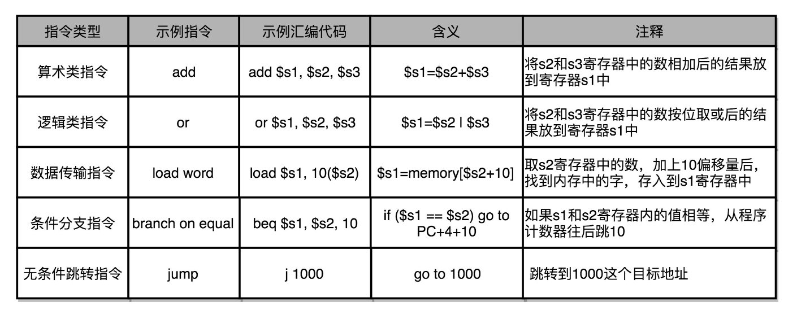
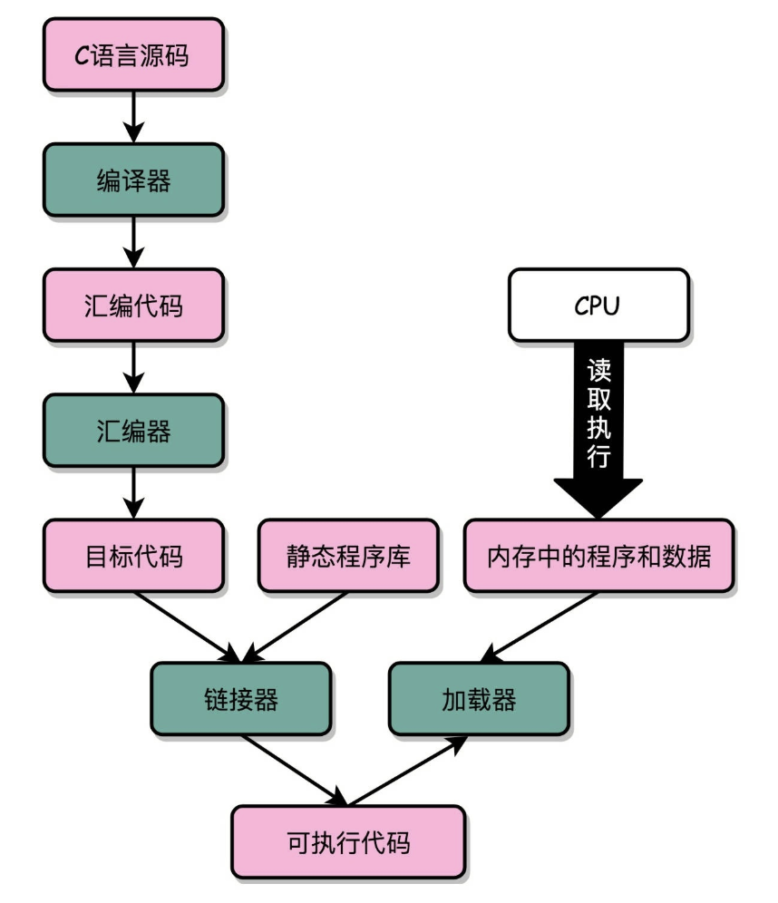
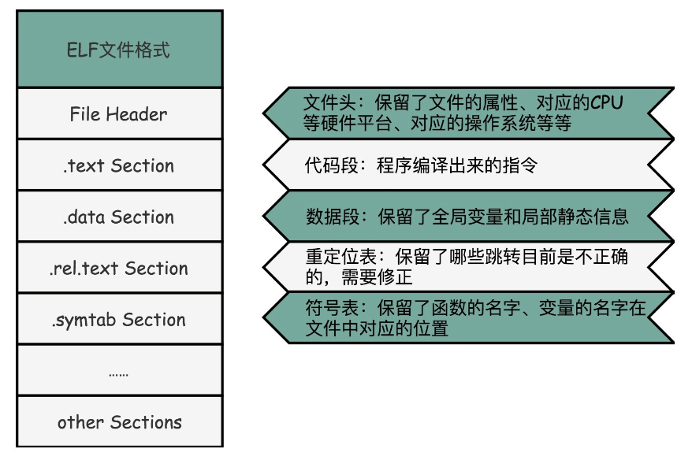
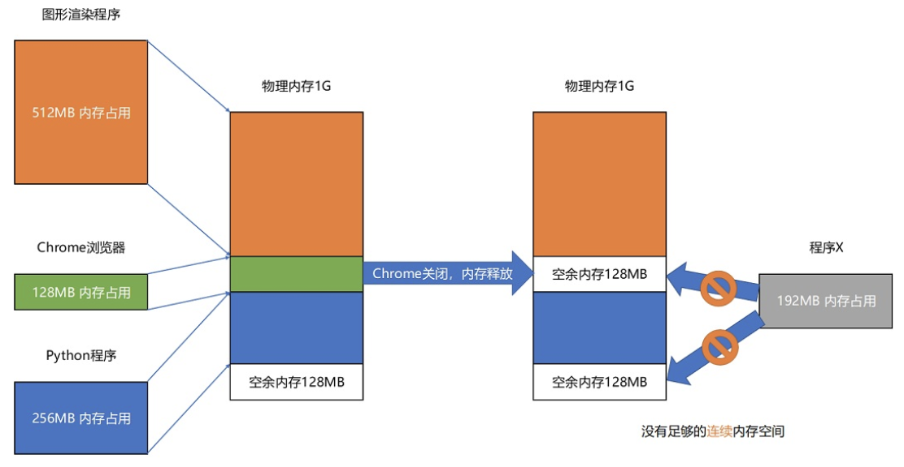
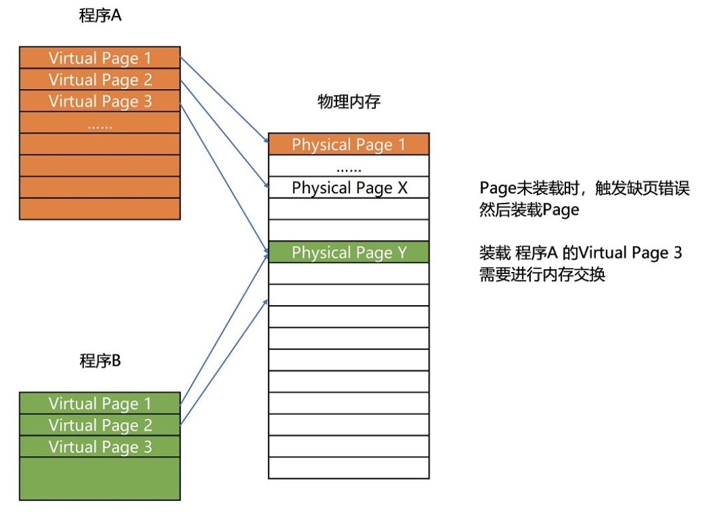
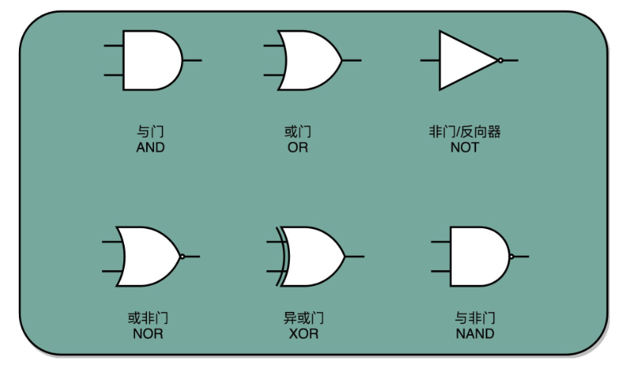
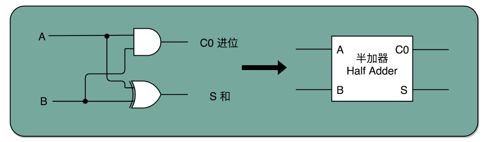
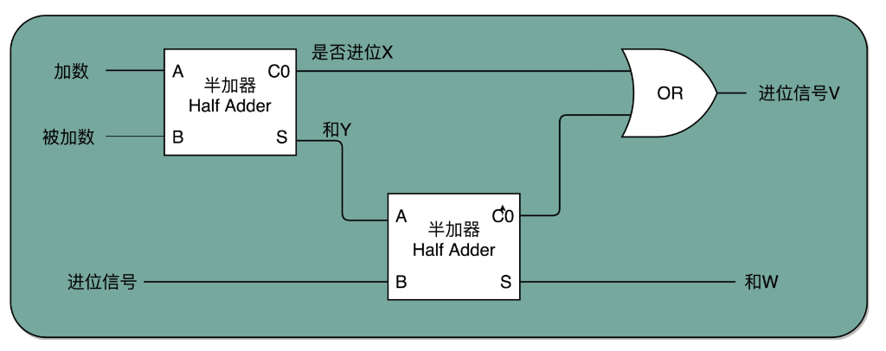
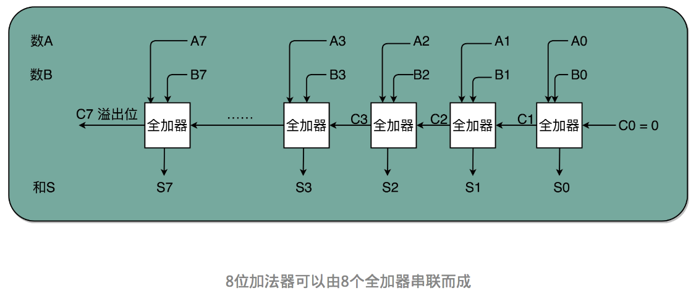

# 读书笔记

## 《深入理解计算机系统》

### 

## 《深入浅出计算机组成原理》

### 入门篇

- 计算机的基本硬件组成：CPU、内存、主板、I/O设备、显卡
- 冯·诺依曼体系结构：运算器、控制器、存储器、输入设备、输出设备
- 知识地图 
- 性能是什么？
  - 性能 = 1/ 响应时间
  - 程序的CPU执行时间 =CPU时钟周期数 × 时钟周期时间
  - 程序的CPU执行时间 = 指令数 × CPI × Clock Cycle Time
- 从哪些方面提升性能
  - 加速大概率事件
  - 通过流水线提高性能
  - 通过预测提高性能
  
### 原理篇：指令和运算

- 指令分类 
  
- [函数调用及栈帧原理](https://zhuanlan.zhihu.com/p/27339191)
- 函数内联的利与弊
  - 优点：CPU需要执行的指令数变少了，根据地址跳转的过程不需要了，压栈和出栈的过程也不用了。
  - 缺点：内联意味着，我们把可以复用的程序指令在调用它的地方完全展开了。如果一个函数在很多地方都被调用了，那么就会展开很多次，整个程序占用的空间就会变大了。
- “C语言代码-汇编代码-机器码” 这个过程，在我们的计算机上进行的时候是由两部分组成的。
  - 第一个部分由编译（Compile）、汇编（Assemble）以及链接（Link）三个阶段组成。在这三个阶段完成之后，我们就生成了一个可执行文件。
  - 第二部分，我们通过装载器（Loader）把可执行文件装载（Load）到内存中。CPU从内存中读取指令和数据，来开始真正执行程序。
- 拆解程序执行 
  
- ELF文件格式 
  
- ELF有一个基本的文件头（File Header），用来表示这个文件的基本属性，比如是否是可执行文件，对应的CPU、操作系统等等。除了这些基本属性之外，大部分程序还有这么一些Section：
  1. 首先是.text Section，也叫作代码段代码段或者指令段（Code Section），用来保存程序的代码和指令；
  2. 接着是.data Section，也叫作数据段数据段（Data Section），用来保存程序里面设置好的初始化数据信息；
  3. 然后就是.rel.text Secion，叫作重定位表重定位表（Relocation Table）。重定位表里，保留的是当前的文件里面，哪些跳转地址其实是我们不知道的。比如上面的 link_example.o 里面，我们在main函数里面调用了add 和 printf 这两个函数，但是在链接发生之前，我们并不知道该跳转到哪里，这些信息就会存储在重定位表里；
  4. 最后是.symtab Section，叫作符号表符号表（Symbol Table）。符号表保留了我们所说的当前文件里面定义的函数名称和对应地址的地址簿。
- 程序装载面临的挑战
  - 内存分段（问题：内存碎片；解决：内存交换） 
    
  - 内存分页 
    
  - 在虚拟内存、内存交换和内存分页这三者结合之下，你会发现，其实要运行一个程序，“必需”的内存是很少的。CPU只需要执行当前的指令，极限情况下，内存也只需要加载一页就好了。再大的程序，也可以分成一页。每次，只在需要用到对应的数据和指令的时候，从硬盘上交换到内存里面来就好了。
- 动态链接：PLT和GOT
- 二进制：[原码 反码 补码](https://www.imooc.com/article/16813?block_id=tuijian_wz)
- 字符串的表示：ASCII码 字符集 字符编码
- 门电路 
  
- 半加器 
  
- 全加器 
  
- 八位加法器 
  
- 门电路 -> 半加器 -> 全加器 -> 加法器 -> ALU

## 《Redis设计与实现》

## 《MySQL权威指南》

## 《HTTP权威指南》
