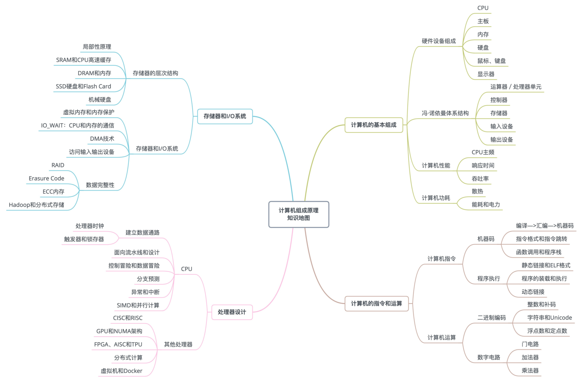

# 读书笔记

## 《深入理解计算机系统》

### 

## 《深入浅出计算机组成原理》

### 入门篇

- 计算机的基本硬件组成：CPU、内存、主板、I/O设备、显卡
- 冯·诺依曼体系结构：运算器、控制器、存储器、输入设备、输出设备
- 知识地图 
- 性能是什么？
  - 性能 = 1/ 响应时间
  - 程序的CPU执行时间 =CPU时钟周期数 × 时钟周期时间
  - 程序的CPU执行时间 = 指令数 × CPI × Clock Cycle Time
- 从哪些方面提升性能
  - 加速大概率事件
  - 通过流水线提高性能
  - 通过预测提高性能
  
### 原理篇：指令和运算

- 指令分类 

## 《Redis设计与实现》

## 《MySQL权威指南》

## 《HTTP权威指南》
